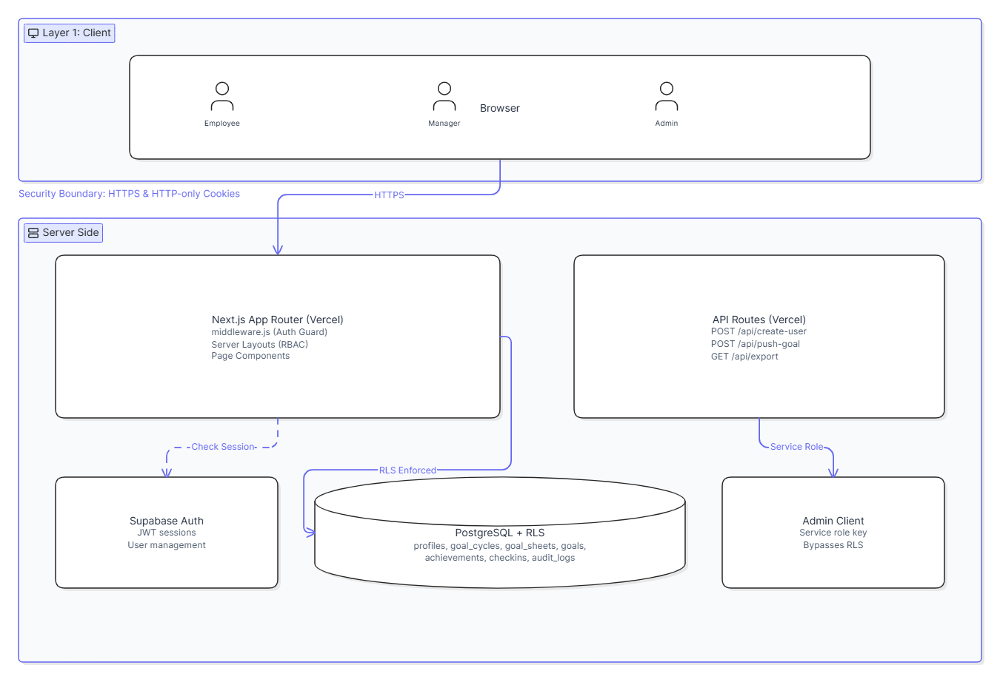
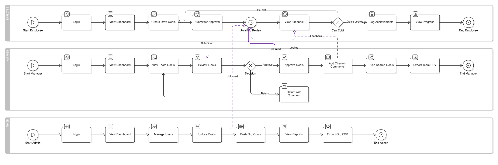
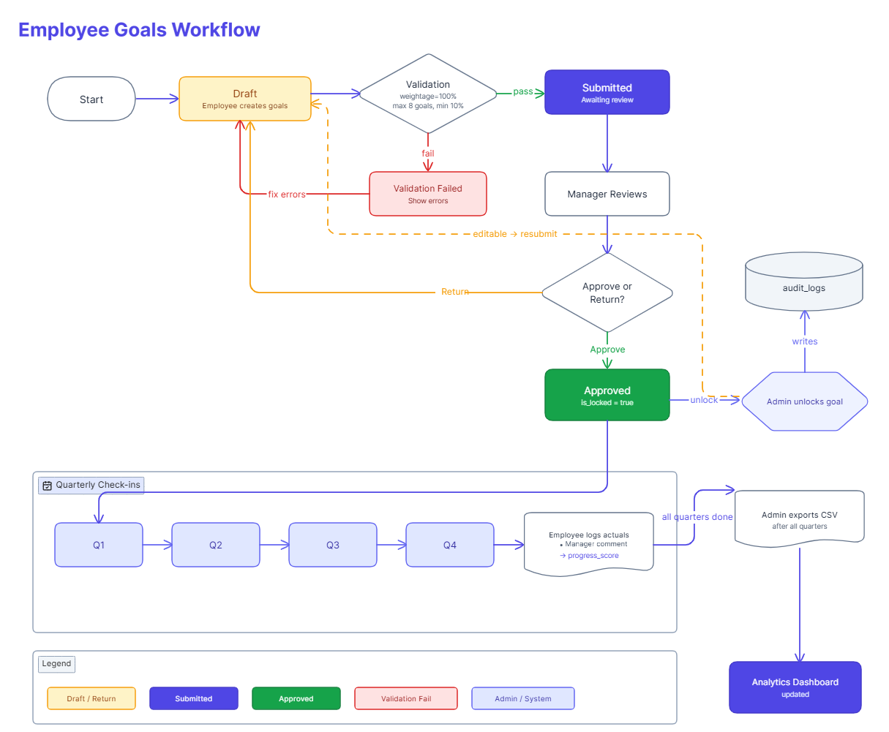

# AtomQuest — Goal Tracking Portal

A production-grade internal goal setting and performance tracking portal built for AtomQuest (ATOMBERG HACKATHON). Supports a full goal lifecycle — from employee goal creation to manager approval, quarterly check-ins, and admin reporting.

**Live Demo:** [https://atomquest-goal-tracker-alpha.vercel.app](https://atomquest-goal-tracker-alpha.vercel.app)

**Demo Credentials:**

| Role | Email | Password |
|---|---|---|
| Admin | admin@atomquest.com | Admin@123 |
| Manager | manager@atomquest.com | Manager@123 |
| Employee 1 | employee@atomquest.com | Employee@123 |
| Employee 2 | employee2@atomquest.com | Employee@123 |

---

## Table of Contents

- [Overview](#overview)
- [Features](#features)
- [Tech Stack](#tech-stack)
- [Architecture](#architecture)
- [Database Schema](#database-schema)
- [Business Rules](#business-rules)
- [Getting Started](#getting-started)
- [Project Structure](#project-structure)
- [Deployment](#deployment)
- [Future Enhancements](#future-enhancements)

---

## Overview

AtomQuest is an in-house goal management system supporting three user roles — **Employee**, **Manager**, and **Admin** — across a structured annual goal cycle with quarterly check-ins.

Employees set goals with measurable targets, managers review and approve them, and both parties track quarterly progress with computed performance scores. Admins oversee the entire organisation, manage users, unlock goals, view audit trails, and export reports.

---

## Features

### Employee
- Create up to 8 goals per cycle with thrust area classification
- Four UoM types: Min (higher is better), Max (lower is better), Timeline (date-based), Zero (zero = success)
- Live weightage meter — enforces exactly 100% total, minimum 10% per goal
- Save as Draft (partial) or Submit for Approval (requires 100%)
- Goals pre-populate on return — no data loss on navigation
- Quarterly achievement logging with live progress score preview
- View manager check-in feedback per quarter

### Manager
- Team dashboard showing all direct reports and goal sheet statuses
- Inline goal editing during review (target values, weightages)
- Approve (locks all goals) or Return with comment workflow
- Quarterly check-in comments per employee
- Push shared goals to team members
- CSV export for team performance data

### Admin
- Create new user accounts (employee/manager/admin) with automatic profile setup and rollback guard
- Central dashboard — all employees, sheet statuses, goal lock status
- Unlock individual goals with automatic audit log entry
- Push shared goals across the entire organisation
- Completion reports — Q1–Q4 check-in matrix (employee vs manager)
- Analytics dashboard — quarterly score trends, goal distribution by thrust area, manager effectiveness
- Audit log viewer — full history of post-lock changes with old/new value comparison
- CSV export for full organisation

### System
- Role-based access control enforced at server layout level (not just client-side)
- Row Level Security on all Supabase tables
- All cycle dates read from database — no hardcoded dates
- Progress scores computed via formula library and persisted to DB
- Shared goal achievement sync — primary owner updates flow to all recipients automatically

---

## Tech Stack

| Layer | Technology |
|---|---|
| Framework | Next.js 14 (App Router) |
| Styling | Tailwind CSS v4 |
| Database | Supabase (PostgreSQL) |
| Auth | Supabase Auth |
| Charts | Recharts |
| Deployment | Vercel |

---

## Architecture Diagrams

### System Architecture


### User Roles & Access


### Goal Lifecycle


## Architecture

```
┌─────────────────────────────────────────────────────┐
│                    Browser Client                   │
│         React Components + Tailwind CSS             │
└──────────────────────┬──────────────────────────────┘
                       │ HTTPS
┌──────────────────────▼──────────────────────────────┐
│                  Next.js on Vercel                  │
│                                                     │
│  ┌─────────────────┐    ┌──────────────────────┐    │
│  │  App Router     │    │   API Routes         │    │
│  │  Pages &        │    │  /api/create-user    │    │
│  │  Layouts        │    │  /api/push-goal      │    │
│  │                 │    │  /api/export         │    │
│  │  Middleware     │    │                      │    │
│  │  (Auth guard)   │    │  Service Role Key    │    │
│  └────────┬────────┘    └──────────┬───────────┘    │
└───────────┼──────────────────────┼──────────────────┘
            │ Supabase JS          │ Supabase Admin
┌───────────▼──────────────────────▼──────────────────┐
│                    Supabase                        │
│                                                    │
│  ┌──────────────┐    ┌──────────────────────────┐  │
│  │  Auth        │    │  PostgreSQL              │  │
│  │  (Sessions,  │    │  (profiles, goals,       │  │
│  │   Users)     │    │   achievements,          │  │
│  │              │    │   audit_logs, ...)       │  │
│  └──────────────┘    │                          │  │
│                      │  Row Level Security      │  │
│                      │  on all tables           │  │
│                      └──────────────────────────┘  │
└────────────────────────────────────────────────────┘
```

**Request Flow:**
1. User hits Vercel → Next.js middleware checks session cookie
2. No session → redirect to `/login`
3. Session exists → server layout checks role from `profiles` table
4. Wrong role → redirect to correct dashboard
5. Correct role → page renders, Supabase client fetches data with RLS enforced

---

## Database Schema

| Table | Purpose |
|---|---|
| `profiles` | Extends auth.users — stores role, manager_id, department |
| `goal_cycles` | FY cycle with quarter open dates, managed by admin |
| `thrust_areas` | Goal categories tied to a cycle |
| `goal_sheets` | One per employee per cycle — tracks status (draft/submitted/approved/returned) |
| `goals` | Individual goals — weightage, UoM type, target, lock status, shared flag |
| `achievements` | Quarterly actuals per goal — stores computed progress_score |
| `checkins` | Manager quarterly comment per employee sheet |
| `audit_logs` | Post-lock change history — who, what, when, old/new JSONB values |

**RLS:** All tables have Row Level Security enabled. Employees see only their own data. Managers see their direct reports. Admins see everything. `thrust_areas` and `goal_cycles` are public read (reference data).

---

## Business Rules

### Goal Validation
- Total weightage across all goals **must equal exactly 100%** before submission
- Minimum weightage per goal: **10%**
- Maximum goals per employee per cycle: **8**

### Goal Lifecycle
```
draft → submitted → approved (all goals locked)
                 ↘ returned (back to editable)
```
- Goals are locked (`is_locked = true`) on manager approval
- Only Admin can unlock — every unlock writes to `audit_logs`
- Post-lock edits by employee also write to `audit_logs`

### Progress Score Formulas
| UoM Type | Formula | Use Case |
|---|---|---|
| Min | `actual / target` | Revenue, output metrics |
| Max | `target / actual` | Cost, TAT (lower is better) |
| Timeline | `completion_date <= deadline ? 1 : 0` | Project milestones |
| Zero | `actual === 0 ? 1 : 0` | Safety incidents, defects |

### Shared Goals
- Manager/Admin pushes a goal to multiple employees
- Recipients can only edit weightage — title and target are read-only
- Primary owner's achievement updates sync automatically to all linked copies

---

## Getting Started

### Prerequisites
- Node.js 18+
- A Supabase project
- Git

### Installation

```bash
git clone https://github.com/FLASH2332/AtomQuest
cd AtomQuest
npm install
```

### Environment Setup

Create a `.env.local` file at the root:

```env
NEXT_PUBLIC_SUPABASE_URL=https://your-project.supabase.co
NEXT_PUBLIC_SUPABASE_ANON_KEY=your-anon-key
SUPABASE_SERVICE_ROLE_KEY=your-service-role-key
```

Find these in your Supabase project → Settings → API.

> ⚠️ Never commit `.env.local` or expose `SUPABASE_SERVICE_ROLE_KEY` in client-side code.

### Database Setup

1. Go to your Supabase project → SQL Editor
2. Run the full schema from `schema.sql` in the repo root
3. This creates all tables, RLS policies, and seeds the default cycle and thrust areas

### Run Locally

```bash
npm run dev
```

Open [http://localhost:3000](http://localhost:3000).

---

## Project Structure

```
/app
  /login                  → Login page + server action
  /dashboard              → Role-aware redirect after login
  /employee
    layout.js             → Server layout — enforces employee role
    /dashboard            → Goal sheet status + goals list
    /goals/new            → Goal creation, draft save, submit
    /checkin              → Quarterly achievement logging
  /manager
    layout.js             → Server layout — enforces manager/admin role
    /dashboard            → Team overview
    /review/[sheetId]     → Goal approval workflow
    /checkin/[sheetId]    → Quarterly check-in comments
    /push-goal            → Push shared goals to team
  /admin
    layout.js             → Server layout — enforces admin role
    /dashboard            → All employees, goal unlock, cycle info
    /users/new            → Create new user accounts
    /push-goal            → Push shared goals org-wide
    /reports              → Check-in completion matrix + CSV export
    /audit-logs           → Post-lock change history viewer
    /analytics            → Charts — scores, goal distribution, manager effectiveness
  /api
    /create-user          → POST — admin creates auth user + profile (service role)
    /push-goal            → POST — push shared goals with capacity validation
    /export               → GET — CSV export of goals vs actuals

/components
  Navbar.js               → Role-aware global navigation bar

/lib
  supabase.js             → Browser + server + admin Supabase clients
  scores.js               → Progress score formula library
  types.js                → JSDoc type definitions mirroring DB schema

middleware.js             → Auth guard — redirects unauthenticated users to /login
schema.sql                → Full database schema with RLS policies
agents.md                 → AI agent context file with business rules
```

---

## Deployment

The app is deployed on **Vercel** with automatic deploys on push to `main`.

### Deploy Your Own

1. Push repo to GitHub
2. Go to [vercel.com](https://vercel.com) → New Project → Import repo
3. Add environment variables:
   - `NEXT_PUBLIC_SUPABASE_URL`
   - `NEXT_PUBLIC_SUPABASE_ANON_KEY`
   - `SUPABASE_SERVICE_ROLE_KEY`
4. Deploy

---

## Future Enhancements

- **Escalation Module** — Rule-based auto-notifications when employees haven't submitted goals or managers haven't approved within N days of defined windows
- **Email Notifications** — Triggered on submission, approval, return, and check-in deadlines via Resend or Supabase Edge Functions
- **Azure AD SSO** — Enterprise single sign-on for company email-based login
- **Admin Cycle Management UI** — Create and configure new FY cycles and quarter dates from the dashboard without SQL
- **Department Analytics** — Multi-department comparison once organisation has multiple departments populated
- **Mobile App** — React Native client for on-the-go check-ins
- **GCP Cloud Run Deployment** — Production deployment with Docker containerisation, Cloud Run autoscaling, and Cloud SQL for enterprise scale
- **Cascade Delete for Shared Goals** — Application-level cleanup when primary owner's shared goal is deleted

---

## Built By

Jayadev D — [github.com/FLASH2332](https://github.com/FLASH2332) · [linkedin.com/in/jayadev-d](https://linkedin.com/in/jayadev-d)

Built for the AtomQuest Hackathon — May 2026